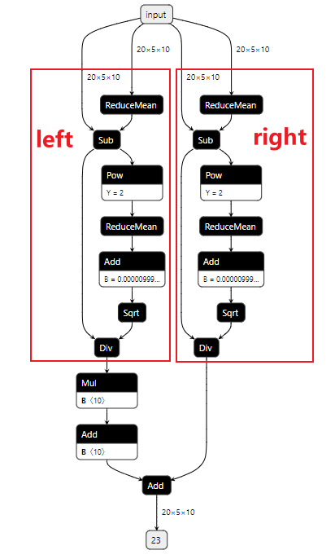
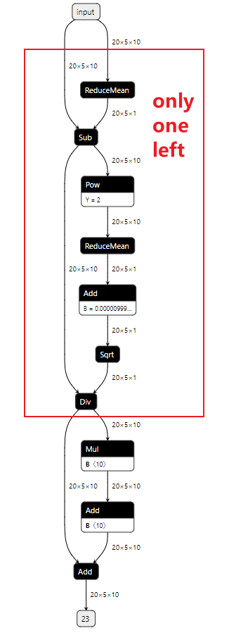
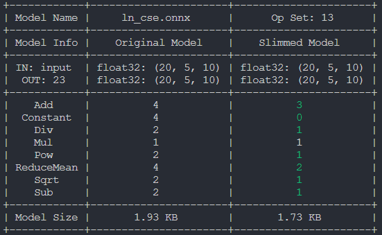

# Common SubExpression Elimination

## Introduction
Common Subexpression Elimination (CSE) is a powerful optimization technique commonly employed in compilers to improve the efficiency of code execution. It targets redundant computations within a program by identifying and removing duplicate expressions, thus reducing both computational overhead and memory usage. By eliminating redundant computations, CSE enhances the overall performance of slimmed onnx model.

## How CSE Works
In many programs, certain expressions are computed multiple times within a given scope, even though their results remain constant across these computations. Common subexpressions refer to these redundant expressions. CSE identifies such common subexpressions and replaces subsequent occurrences with references to the original computation result. This process effectively reduces the number of computations required during program execution.

For example, consider the following code snippet:
```
int a = b + c;
int x = b + c;
```
In this code, b + c is a common subexpression computed twice. With CSE, the redundant computation of b + c would be eliminated, and both occurrences of x would directly reference the computation result of a.

## Running the example

```bash
python cse_demo.py # to generate onnx model for demo
```



There are two identical blocks that are doing the same things.

```bash
onnxslim ln_cse.onnx slim.onnx
```

After onnxslim, the output will look like this:




and the summary is as follow:

