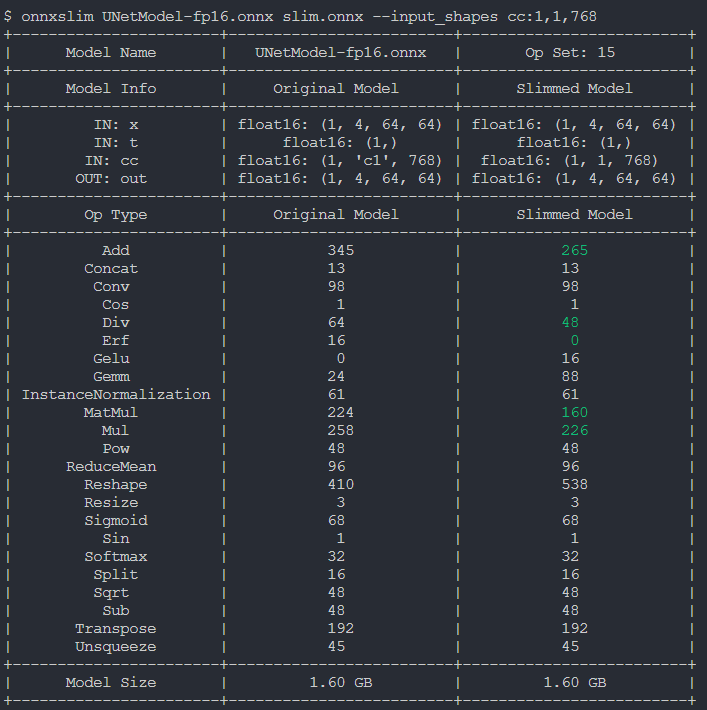

# Input Shape Modification

## Introduction
OnnxSlim includes an exploration of essential input shape modification techniques for ONNX models.

This concise guide unveils techniques for seamlessly adjusting input tensor dimensions, ensuring optimal compatibility and performance within the dynamic landscape of neural network architectures.

## Running the example
Change the input model by running:

```bash
onnxslim UNetModel-fp16.onnx slim.onnx --input_shapes cc:1,1,768
```

The slimmed model will look like this:

