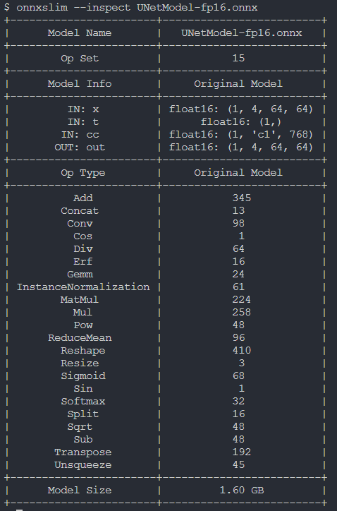

# Model Inspect

## Introduction
Dive deep into the intricacies of your ONNX model using the powerful --inspect argument with OnnxSlim. This feature provides detailed insights into various aspects of your model, including input and output details, operator information, opset version, and more.

## Running the example
Unveil the secrets of your ONNX model by executing the following command:

```bash
onnxslim --inspect UNetModel-fp16.onnx
```

The output will look like this:

