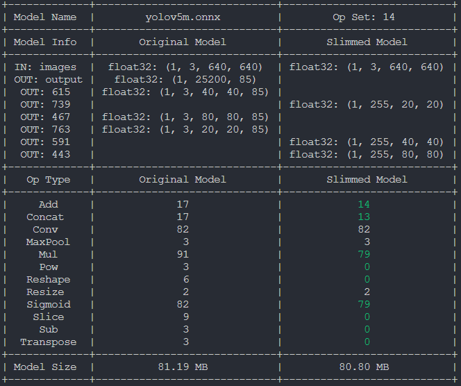

# Output Modification

## Introduction
OnnxSlim provides capabilities for modifying the output specifications of ONNX models.

This section explores techniques to customize the outputs, allowing for flexibility in handling diverse model requirements.

## Running the example
Change the output of one model by running:

```bash
onnxslim yolov5m.onnx slim.onnx --outputs 591 739 443
```

The slimmed model will look like this:

